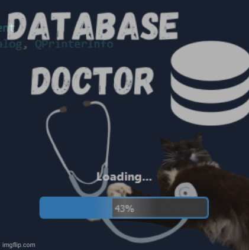

# 🖥️ DBDoc Desktop GUI – Technician Interface

  

This is the local desktop interface for technicians and admins to manage repair shop data, built using **PyQt5**.  
It connects directly to the MariaDB database over a secure SSL connection.

---

## Features

- Secure login screen with password toggle
- Settings page to configure DB host and name
- View all database tables with pagination
- Inline editing + dropdowns for job statuses
- Dashboard + query tools (planned expansion)
- Backup/Restore `.sql` dumps
- Export entire database to Excel (multi-sheet)
- Schedule backups using a JSON config
- Change DB user password from the GUI
- Modern dark-themed UI with animations and emoji buttons

---

## Note

This desktop technician interface is designed to work seamlessly with the TechRepair Booking Form system:

Booking Portal Repository:
https://github.com/Bankableflunky5/Booking-in-Form